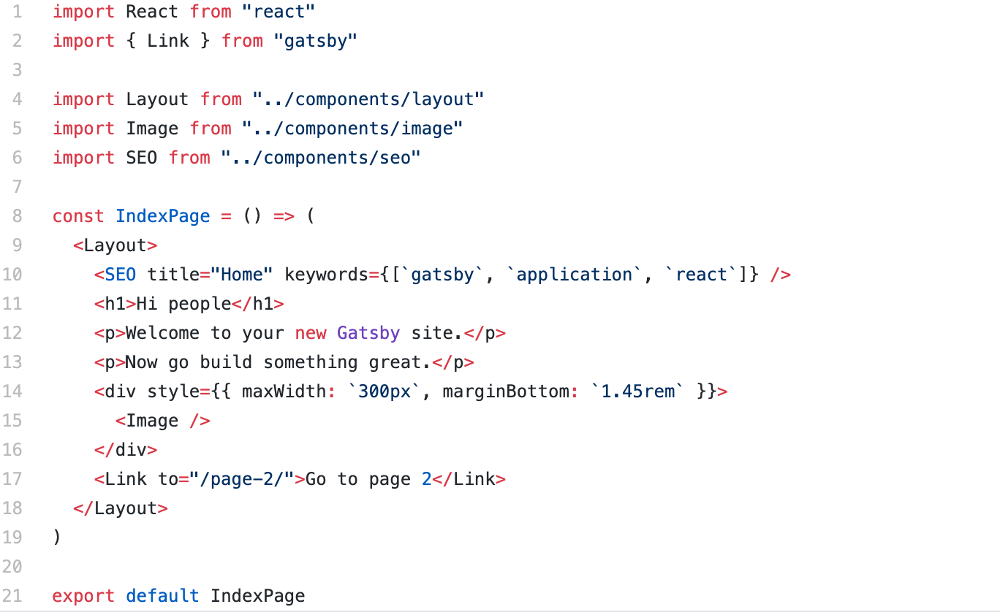
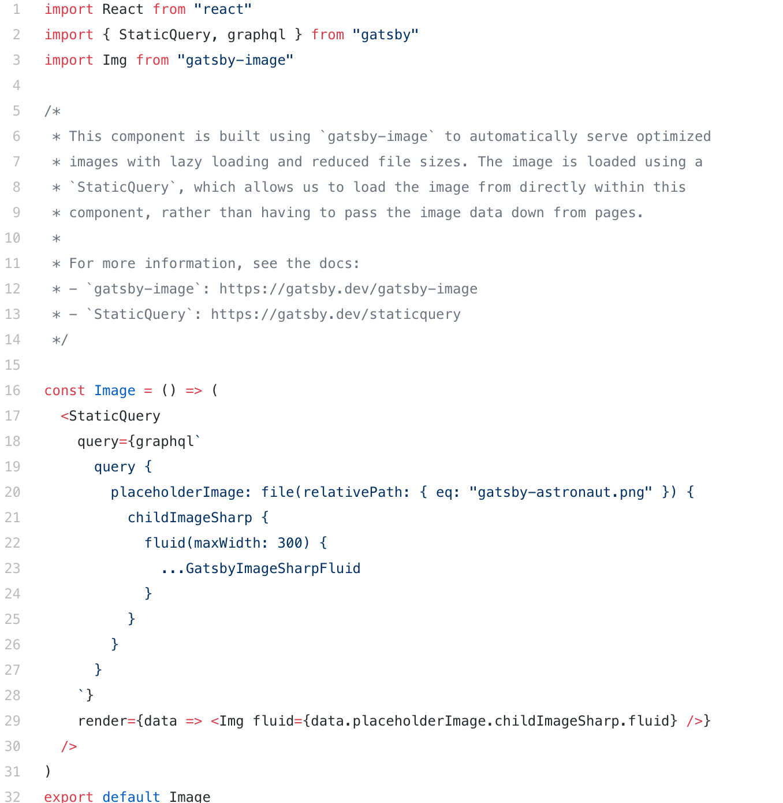

<h1>All you need to know about GatsbyJS</h1>

## What is GatsbyJS?

In their own words, “Gatsby is a free and open source framework based on React that helps developers build blazing fast websites and apps.”

Why would we need a framework on top of a framework (or a library)? Isn’t React a tool that “helps developers build websites and apps”? This is a reasonable question. It is often posed about tools such as Next.js.

React is a library that is meant to provide a certain set of core functionality for developers to leverage. It is intended to be lightweight and broadly applicable.

Gatsby, on the other hand, is, “a static PWA (Progressive Web App) generator. You get code and data splitting out-of-the-box. Gatsby loads only the critical HTML, CSS, data, and JavaScript so your site loads as fast as possible. Once loaded, Gatsby prefetches resources for other pages so clicking around the site feels incredibly fast.”

Gatsby is a static site generator that leverages React.

## What are static sites?

Static sites have been around for a very long time. In fact, they are probably the original website: just HTML, CSS, and JavaScript. They are not rendered during runtime; there is no server-side code, no database, etc.

A static site generator is a tool that generates static sites. With regard to JS frameworks and libraries, these usually generate HTML content on the client side during runtime. Static site generators generate this content during build time. Then, once loaded, React takes over, and you have a single-page application!

How is this different from server-side rendering? This is a great question. The main difference is that there is no server-side code. So, unlike a tool such as Next.js, Gatsby does not render anything on the server when a request is made. This is all done at build time of the application.

Some of the benefits of a static site are: speed, search engine optimization, and security. Not only are sites made with Gatsby blazing fast, but they have an implicit security since there is no database or server, and unlike standard React applications, they make SEO much easier since crawlers can find the content.

## Getting started

To get started, you just download the Gatsby CLI: `npm i -g gatsby`. This command line tool will allow you to generate, run, and build a Gatsby application.

To get myself up and running quickly, I used the Gatsby default starter repository. After cloning this, I ran `npm install`, and then `gatsby develop`. This left me with a fully active Gatsby application running on `http://localhost:3000`.

To confirm that pages have already been rendered, you can visit any of the pages and click View source. Note, though, that you can also click links, and the page will update without a full refresh, as you would expect from a PWA.

## Why Gatsby?

Gatsby has some great features that differentiate it from other static site generators.

First and foremost, Gatsby leverages React, so it is a great choice for those who are comfortable with and love it.

Gatsby also makes use of GraphQL, which is a popular and very powerful technology. It uses GraphQL to manage data throughout the application, and though you can use Gatsby without GraphQL, it really makes the development of applications more declarative and intuitive.

Gatsby pairs really well with platforms like Netlify, and you can easily configure your site to build and deploy every time you commit and push to GitHub.

Gatsby also comes with a great ecosystem of plugins that serve various needs. These plugins can help you source data from CMSs like WordPress or Contentful, help you integrate with tools like Algolia, and manage your images by lazy-loading and optimizing them.

Gatsby also provides a wealth of APIs that make the development of static sites much easier — for example, the `createPage` API that makes it really easy to transform markdown files into static pages with a template at build time.

Finally, Gatsby has a bunch of great components that simplify things like routing, linking, and handling images, which are not included in the core React library.

## Designing your site

Designing a look and feel was truthfully the most difficult part of the experience. I felt paralyzed by possibilities to some extent. A couple of things helped me move forward.

First, I looked at pages and pages of <a href="https://facebook.com">Awwward-winning portfolio websites</a> to gather inspiration and get a sense of <a href="https://facebook.com"> the great designs that are out there.</a>

Second, I read a great article by Adham Dannaway about his process when designing and creating his own personal site.

I committed to designing a few of my own custom animations and SVGs. This was quite fun, and I cannot recommend Figma enough for this endeavor. If you are familiar with Sketch, it will be extremely simple to use.

## Developing your site

To get off the ground, I used the <a href="https://github.com/gatsbyjs/gatsby-starter-default/">Gatsby starter repository.</a> I forked this from GitHub and renamed the repo. Then I cloned it and used the Gatsby CLI to build. In a very short time, I was up and running on localhost with a live and hot-reloading application.

The structure of the code is very simple. You have three folders inside the src directory: `components`, `images`, and `pages`.

The `images` directory contains a couple png’s that are used in the site.

The `components` directory contains several components of note. First, the `layout.js` component: it is a wrapper component designed to provide styling and functionality across the application. This kind of pattern is very popular in React. You will notice that there is a binding called `{children}` in the center of the component.

  

  
This represents the content to be passed inside the component. You can see this component at work in `index.js` in the `pages` directory:
  

  
The other noteworthy component is `image.js`:
  

  
This component shows a couple interesting things. First, it gives a bit of visibility into how GraphQL is used within Gatsby. The StaticQuery at the bottom of the component is designed to pull in the image at build time and enumerate some of the image processing specifications (fluid with a max width of 300). It then passes this into the Gatsby Image component, which optimizes the image, creates several sized versions of it, and will lazy-load it at runtime.

Under pages, you have the main index.js, a secondary page, and a 404 page. In index.js, you can see how the layout component is put to work, and also how you can link to other pages such as page-2.js using Gatsby’s Link component. Anything in this folder will be transformed into static pages by Gatsby at build time.

This provides a lot of what you need out of the box! You can get to work building pages and components straightaway. However, if you want to dynamically create pages from, say markdown files, you can follow this simple tutorial on Gatsby’s website.

## Searching your site

One of the downsides of not having a server is that searching your site isn’t straightforward. This can be circumvented by using some great tools like Algolia. Gatsby has some great guides to implementing this feature with Algolia or other tools like Lunr and ElasticSearch.

## Deploying your site

Once you’ve created a site, you need to think about how to host it. There are two great options that lead the pack: GitHub Pages and Netlify.

I went with Netlify because they provide continuous deployment (Git-triggered builds), a global CDN, full DNS, automated HTTPS, and a lot more.

Their free tier includes “unlimited personal and commercial projects, HTTPS, continuous deployment from public or private repos, and more.” I was also able to easily purchase the domain name I needed through Netlify. It was essentially a one-stop shop for everything I needed to get my site live.

Adding your site to Netlify is as simple as creating an account, linking your GitHub, and clicking the Create site from git button.

## Retrospective

Should I have gone with another generator? Should I have just built a site with React or Next.js? Gatsby has advantages and downsides. However, many of the downsides are minimized by certain use cases. For the creation of a personal site, Gatsby turned out to be the perfect choice for me.

The workflow is extremely simple: when I make changes and push them to GitHub, my site is redeployed. I don’t need to concern myself too much with infrastructure, etc. Netlify handles all that for me.

It maintains a great balance between allowing me to code and reducing boilerplate code.

I love the gatsby-image plugin, and the ability to use GraphQL really simplifies passing data into my components.

The only thing I didn’t love was that some of the configuration required in files like gatsby-node.js didn’t seem all that intuitive to me.

## Conclusion

In conclusion, I would really recommend Gatsby to those looking for a candidate to develop smaller sites like portfolios and personal blogs — it really shines in these use cases.

It carries with it all the benefits of static websites, such as speed, security, and SEO, and it is especially wonderful for those who like to do a bit of coding and don’t want to just use WordPress or SquareSpace!
