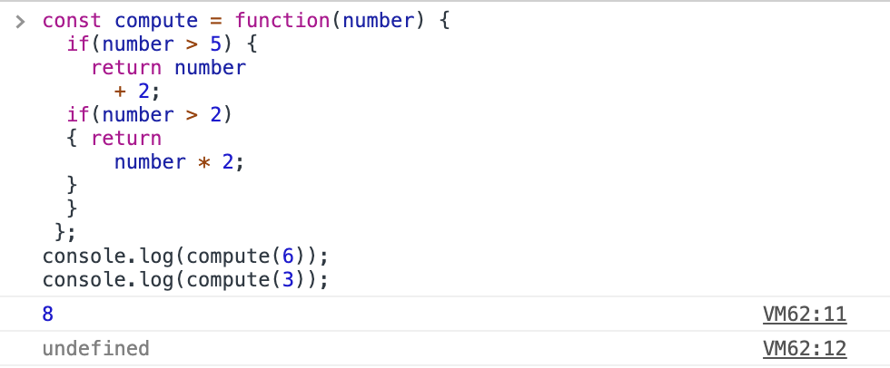
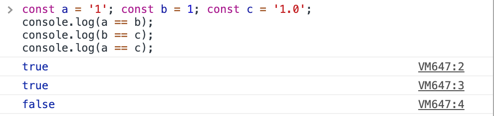
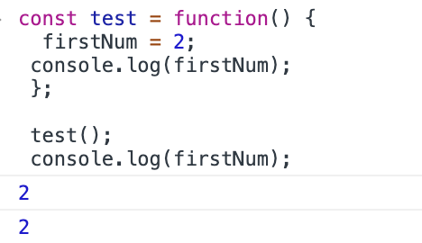
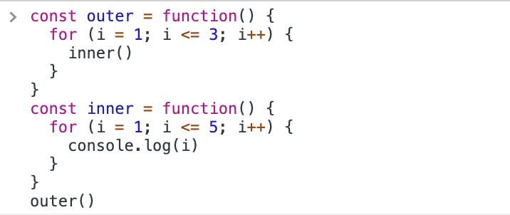

<h1>Some of JavaScript Tricks</h1>

## introduction

In this article we’ll learn about some of the most fundamental unpleasant semantical idiosyncrasies in JavaScript. Knowing these first will help you stay clear of common pitfalls when coding in JavaScript.

We’ll start by looking at the way the language treat semicolons. Then we’ll look at the troublesome == operator, discuss the consequences of forgetting to explicitly define variables, and explore ways to cope with these issues.
Be Careful Where You Break Lines.

## How JS treat semicolon ? :

A number of dynamically typed programming languages don’t care about semicolons and treat them as optional syntax. JavaScript is not one of them—semicolons are not optional. In some places a semicolon is critical, while in other places it’s more of a stylistic choice. However, if you leave out a semicolon where it’s required, JavaScript will not complain. Merely placing a ; is not sufficient. We have to truly understand JavaScript’s automatic semicolon insertion (ASI) rules.

A valid program ends with a ;. If a given script does not end with a ;, then JavaScript inserts a ; automatically.
As the tokens are parsed from left to right, if an unexpected token is encoun- tered and a line break separates it from the previous token, then a ; is automatically inserted before the encountered token. For example, consider this code snippet:


The bad part of the code, however, is that the token second is not expected after first, even though a line break separates the two. So, JavaScript quietly inserts a ; before the variable second. This results in first taking on a value of undefined and the variable second turning into a global variable. We can see this from the output:

```javascript
undefined
1
1
```

If a candidate token is break, continue, return, throw, or yield, and a line break appears between the candidate token and the next token, then JavaScript automatically inserts a ; after the candidate token. For example, the second return in the following code is not written correctly:



Since the second return is followed by a line break, JavaScript automatically inserts a ; right after the return, thus returning nothing—that is, undefined, as we see from the output:

```javascript
8
undefined
```

In the first return, even though there is no ; on that line, it is legal for + to follow number so no ; was inserted on that line. But try changing + 2 to 2 on line 5 and JavaScript will insert a ; before 2, resulting in an output of 6 instead of giving an error for seeing unreachable code.

If a line is relatively short, end it with a clearly visible semicolon. By convention we don’t place ; after the } that ends a code branch. If a line is long, then break it into multiple lines, but do so in such a way that JavaScript does not deviate from your intentions by automatically placing semicolons.

## Use === Instead of ==

**have a look on the below example :**



The == operator performs type coercion if the things being compared are not of the same type. If the objects or values being compared are both of type string, number, or boolean, then a direct equality check is performed.

**In the above example:**

1. a == b ---> type conversion done because type of a != type of b so after type conversion a == b results true
2. (b == c) ---> the same like 1
3. (a == c) ---> type of a != type of c so no type conversion done and lexical comparison is used so the string value of a != string value of c which yields to false

One situation where == may be a better choice than === is when you want to determine if a variable is either null or undefined—the check variable == null will yield true if variable is null or undefined and may be used instead of variable === null || variable === undefined.

if we want a strict equality check, with no type coercions. We should use === instead of ==


## Declare Before Use

### example 1 :

look at the following code :


the firstnum variable is used before being declared explicity , so javascript considers this variable as a global variable. As a result , it can be used inside and outside the method so that it can prints the value as in the above example .

what if we declared the firstnum variable before use like `let firstnum=2` ??
we will get a failure at runtime that this variable is not defined

### example 2 :

look at the following code :

what do you expect the result will be ?
I think that the actual output will not be as you expected .as the above code will output the following :<br/>
1<br/>
2<br/>
3<br/>
4<br/>
5<br/>
but why !!! ???

The function outer() uses a variable i but without declaring it first. As a result, that variable fell into global scope. After setting a value of 1 for i, the outer() function calls the inner() function. Sadly, inner() also uses i without declaring it first and so binds to the same global variable i. At the end of the call to the inner() function, i has a value of 5. When the control flows back to outer(), the variable is way over the bounding value of 3 and so the loop terminates after the first iteration.

so how to fix this issue ?
it will be fixed by declaring the variable ( i ) before using it like below :
`(let i=1;i<=5;i++)`
After this fix, the code will produce the intended result—printing values 1, 2,... 5 three times.

## strict mode

JavaScript is a loosely typed (dynamic) scripting language. If you have worked with server side languages like Java or C#, you must be familiar with the strictness of the language. For example, you expect the compiler to give an error if you have used a variable before defining it.

JavaScript allows strictness of code using "use strict" with ECMAScript 5 or later. Write "use strict" at the top of JavaScript code or in a function.

The strict mode in JavaScript does not allow following things:

1. Use of undefined variables
2. Use of reserved keywords as variable or function name
3. Duplicate properties of an object
4. Duplicate parameters of function
5. Assign values to read-only properties
6. Modifying arguments object
7. Octal numeric literals
8. with statement
9. eval function to create a variable

#### some examples on strict mode :

```javascript
"use strict";

var x = 1; // valid in strict mode
y = 1; // invalid in strict mode

z = 1; // error (use variable before declare it)

var for = 1; // error (user reserved keywords as variables)
var if = 1; // error (user reserved keywords as variables)

var myObj = { myProp: 100, myProp:"test strict mode" }; // error (duplicate prop)
function Sum(val, val){return val + val }; // error (duplicate parameters)

var arr = [1 ,2 ,3 ,4, 5];
arr.length = 10; // error (assign value to read only variable)
```

## Conclusion :

JavaScript is a very powerful language with some unpleasant surprises.We discussed some of javascript tricks that you should know as a developer using javascript.see you on the next article :D
