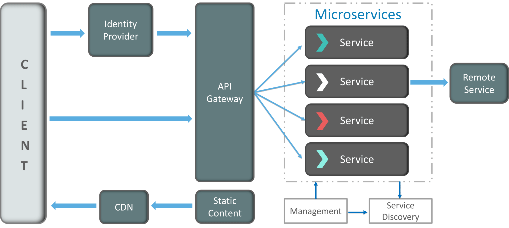
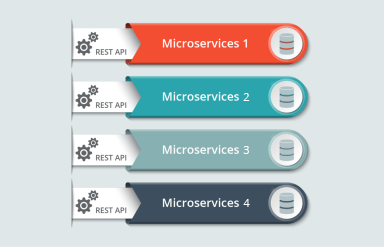
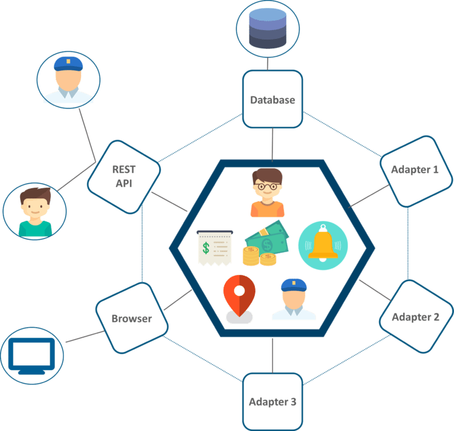
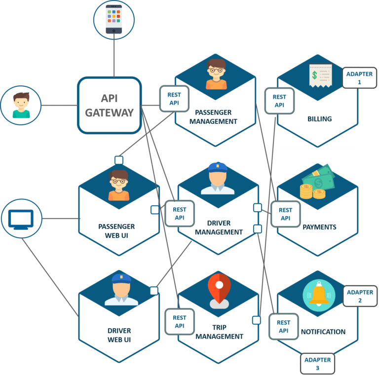

In this article I will talk about :

1. what is microservice & monolith application
2. Benifits of microservice
3. characterstics of microservice
4. pros and cons of microservices
5. examples of microservice
6. how does microservice architecture work ?
7. UBER CASE STUDY
8. When not to use mircoservice

So, let's start

# what is microservice & monolith application

**Microservices**, or microservice architecture, is an approach to application development in which a large application is built as a suite of modular components or services.

Each module supports a specific task or business goal and uses a simple, well-defined interface, such as an application programming interface (API), to communicate with other sets of services.

Unlike microservices, a **monolith application** is built as a single, autonomous unit. This make changes to the application slow as it affects the entire system. A modification made to a small section of code might require building and deploying an entirely new version of software. Scaling specific functions of an application, also means you have to scale the entire application.

Microservices solve these challenges of monolithic systems by being as modular as possible. In the simplest form, they help build an application as a suite of small services, each running in its own process and are independently deployable. These services may be written in different programming languages and may use different data storage techniques. While this results in the development of systems that are scalable and flexible, it needs a dynamic makeover. Microservices are often connected via APIs, and can leverage many of the same tools and solutions that have grown in the RESTful and web service ecosystem.

---

# Benifits of microservice

- **Decoupling :** Services within a system are largely decoupled, so the application as a whole can be easily built, altered, and scaled.  

- **Simpler To Deploy :** Deploy in literal pieces without affecting other services.  

- **Reusability :** Share small services like payment or login systems across the business.  

- **Faster Defect Isolation :** When a test fails or service goes down, isolate it quickly with microservices.  

- **Autonomy :** Developers and teams can work independently of each other, thus increasing speed.
    
- **Mixed Technology stack :** as microservices allow developers to use multiple languages in developing these services  

---

# characterstics of microservice

**1- Multiple Components :**  
software built as microservices can, by definition, be broken down into multiple component services. Why? So that each of these services can be deployed, tweaked, and then redeployed independently without compromising the integrity of an application. As a result, you might only need to change one or more distinct services instead of having to redeploy entire applications. But this approach does have its downsides, including expensive remote calls (instead of in-process calls), coarser-grained remote APIs, and increased complexity when redistributing responsibilities between components.

2- **Built For Business :**  
The microservices style is usually organized around business capabilities and priorities. Unlike a traditional monolithic development approach—where different teams each have a specific focus on, say, UIs, databases, technology layers, or server-side logic—microservice architecture utilizes cross-functional teams. The responsibilities of each team are to make specific products based on one or more individual services communicating via message bus. In microservices, a team owns the product for its lifetime.

3- **Simple Routing :**  
Microservices act in classicaly way : they receive requests, process them, and generate a response accordingly. This is opposite to how many other products such as ESBs (Enterprise Service Buses) work, where high-tech systems for message routing, choreography, and applying business rules are utilized.

4- **Decentralized :**  
Since microservices involve a variety of technologies and platforms, old-school methods of centralized governance aren’t optimal. Decentralized governance is favored by the microservices community because its developers strive to produce useful tools that can then be used by others to solve the same problems. Just like decentralized governance, microservice architecture also favors decentralized data management. Monolithic systems use a single logical database across different applications. In a microservice application, each service usually manages its unique database.

5- **Failure Resistant :**  
Microservices architecture is well built to cope up with failures. There are different kinds of services are working together and communicating with each other and so chances are there that a service could fail. It can happen for a number of reasons. Here all the other services will be allowed to work while the non-functioning service is removed. Keeping an eye on microservices can help you prevent any service failure. This thing itself makes microservices complex compared to the normal monolithic architecture.

---

# pros and cons of microservices

## **Pros**

1. **Flexible tech stack**: “We haven’t had to commit to a tech stack, we use the right tools for the problem e.g. if we have a machine learning problem we use Python as there is a wealth of open source libraries we can make use of. If we just want to do a restful API we use Node.js.  

2. **Better fault isolation:** if one microservice fails, the other will continue to work (although one problematic area of a monolith application can jeopardize the entire system).  

3. **Scaling:** Easy to scale and integrate with third-party services.  

4. **More manageable:** “By taking a single complicated thing and breaking it into smaller things, they become easier to reason about.” This is the Unix design philosophy of building small things that work well (do one thing and do it well) and chaining them together through well-defined interfaces where appropriate.
  
5. **Independence:** “Teams can have their own backlog of change and scale and release independently which allows the organisation as a whole to move faster.”  

## **Cons**

1. They add network and coordination overhead.
2. Microservices can make testing more complex.
3. Latency can be an issue, especially during heavy use.
4. Being a distributed system, it can result in duplication of effort.
5. When number of services increases, integration and managing whole products can become complicated.
6. In addition to several complexities of monolithic architecture, the developers have to deal with the additional complexity of a distributed system.

---

# examples of microservice

Walmart successfully revitalized its failing architecture with microservices.
This is a good example of what should be done when aging architecture begins to negatively affect business. This is the multi-million dollar question which the IT Department of Walmart Canada had to address after they were failing on Black Fridays for two years in a row.

The problem was that It couldn’t handle 6 million pageviews per minute and made it impossible to keep any kind of positive user experience anymore. Before embracing microservices, Walmart had an architecture for the internet of 2005, designed around desktops, laptops and monoliths.

The company decided to replatform its old legacy system in 2012 since it was unable to scale for 6 million pageviews per minute and was down for most of the day during peak events. They wanted to prepare for the world by 2020, with 4 billion people connected, 25+ million apps available. So Walmart replatformed to a microservices architecture with the intention of achieving close to 100% availability with reasonable costs.

**_Migrating to microservices actually brought notable results:_**

1. Conversions were up by 20% literally overnight
2. Mobile orders were up by 98% instantly
3. No downtime on Black Friday or Boxing Day
4. The operational savings were significant as well since the company moved off of its expensive hardware onto commodity hardware
5. They saved 40% of the computing power and experienced 20-50% cost savings overall

---

# how does microservice architecture work ?

  

  

A typical Microservice Architecture (MSA) should consist of the following components:  

1. **Clients :** The architecture starts with different types of clients, from different devices trying to perform various management capabilities such as search, build, configure etc.

2. **Identity Providers:** These requests from the clients are then passed on the identity providers who authenticate the requests of clients and communicate the requests to API Gateway.

3. **API Gateway:** Since clients don’t call the services directly, API Gateway acts as an entry point for the clients to forward requests to appropriate microservices.

**_The advantages of using an API gateway include:_**

- All the services can be updated without the clients knowing.
- Services can also use messaging protocols that are not web friendly.
- The API Gateway can perform cross-cutting functions such as providing security, load balancing etc.
- After receiving the requests of clients, the internal architecture consists of microservices which communicate with each other through messages to handle client requests.

4. **Messaging Formats :**
There are two types of messages through which they communicate:

<u>**_Synchronous Messages:_**</u> In the situation where clients wait for the responses from a service, Microservices usually tend to use REST (Representational State Transfer) as it relies on a stateless, client-server, and the HTTP protocol. This protocol is used as it is a distributed environment each and every functionality is represented with a resource to carry out operations.

<u>**_Asynchronous Messages:_**</u> In the situation where clients do not wait for the responses from a service, Microservices usually tend to use protocols such as AMQP, STOMP, MQTT. These protocols are used in this type of communication since the nature of messages is defined and these messages have to be interoperable between implementations.

The next question that may come to your mind is how do the applications using Microservices handle their data?

5. **Databases :**
Well, each Microservice owns a private database to capture their data and implement the respective business functionality.Also, the databases of Microservices are updated through their service API only. Refer to the diagram below:

6. **Static Content :** After the Microservices communicate within themselves, they deploy the static content to a cloud-based storage service that can deliver them directly to the clients via Content Delivery Networks (CDNs).

7. **Management :** This component is responsible for balancing the services on nodes and identifying failures.

8. **Service Discovery :** Acts as a guide to Microservices to find the route of communication between them as it maintains a list of services on which nodes are located.

---

# UBER CASE STUDY

## UBER’s Previous Architecture

Like many startups, UBER began its journey with a monolithic architecture built for a single offering in a single city. Having one codebase seemed cleaned at that time, and solved UBER’s core business problems. However, as UBER started expanding worldwide they rigorously faced various problems with respect to scalability and continuous integration.

The above diagram depicts UBER’s previous architecture.
A REST API is present with which the passenger and driver connect.
Three different adapters are used with API within them, to perform actions such as billing, payments, sending emails/messages that we see when we book a cab.
A MySQL database to store all their data.
So, if you notice here all the features such as passenger management, billing, notification features, payments, trip management, and driver management were composed within a single framework.

## Problem Statement

While UBER started expanding worldwide this kind of framework introduced various challenges. The following are some of the prominent challenges

- All the features had to be re-built, deployed and tested again and again to update a single feature.
- Fixing bugs became extremely difficult in a single repository as developers had to change the code again and again.
- Scaling the features simultaneously with the introduction of new features worldwide was quite tough to be handled together.

## Solution

To avoid such problems UBER decided to change its architecture and follow the other hyper-growth companies like Amazon, Netflix, Twitter and many others. Thus, UBER decided to break its monolithic architecture into multiple codebases to form a microservice architecture.
Refer to the diagram below to look at UBER’s microservice architecture.

The major change that we observe here is the introduction of API Gateway through which all the drivers and passengers are connected. From the API Gateway, all the internal points are connected such as passenger management, driver management, trip management, and others.

The units are individual separate deployable units performing separate functionalities.
For Example: If you want to change anything in the billing Microservices, then you just have to deploy only billing Microservices and don’t have to deploy the others.

All the features were now scaled individually i.e. The interdependency between each and every feature was removed.
For Example, we all know that the number of people searching for cabs is more comparatively more than the people actually booking a cab and making payments. This gets us an inference that the number of processes working on the passenger management microservice is more than the number of processes working on payments.

In this way, UBER benefited by shifting its architecture from monolithic to Microservices.

---

# When not to use microservices ?

The simple answer would be: any time the cons of microservices really hurt, and/or the benefits are marginal.

Don’t want to invest in (more) extensive logging and monitoring? Don’t go for microservices! You need to be prepared for unfindable bugs or performance issues.

Don’t know which parts of your application need to be scalable? Don’t go microservices.
